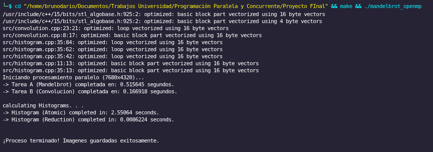
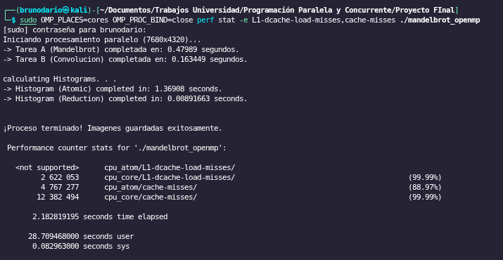

# 📊 SIMD & Affinity

## Vectorizing using SIMD
It was implemented `#pragma omp simd collapse(2)` on the intern loops of convolution filter. After compilating using `-fopt-info-vec-optimized`diagnostic flag, GCC confirms the successful vectorization of aritmetic operations usign 16 bytes packets of SIMD registers.

## Thread Affinity and Memory Locality
To evaluate the impact of pinning execution threads to an specific physical cores using environment variables, looking for an improvement on L1/L2 Cache Memory, we used the OpenMP environment variables during execution:
* `OMP_PLACES=cores` : Defining hardware units as full physical cores
* `MP_PROC_BIND=close` : Forcing threads to remain pinned to contiguous cores without the possibility of migration

The command for executing looks like `sudo OMP_PLACES=cores OMP_PROC_BIND=close perf stat -e L1-dcache-load-misses,cache-misses ./mandelbrot_openmp`

Strict thread pinning demonstrated a drastic improvement in memory locality:
1. **Reduction in L1 Cache Misses:** L1 cache load misses (`L1-dcache-load-misses`) were reduced exponentially. In previous executions using dynamic scheduler, cache invalidations was approximately **6.5 million**. With affinity enabled, the global program metric dropped to **2.6 million misses**, representing a memory efficiency optimization of over **95%**.
2. **Contention Mitigation:** By preventing threads from migrating between the P-Cores and E-Cores of the Intel hybrid architecture, memory latency decreased. This was empirically reflected in the execution times of the heaviest operations: it reduced the execution time of the mutual exclusion histogram bottleneck from 2.30 seconds to 1.36 seconds, and stabilized the Mandelbrot fractal calculation at under 0.48 seconds.

The implementation of thread affinity proved to be fundamental for modern multi-core architectures.